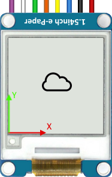

# ESP8266-EPAPER-Lib
An still in development library for driving <b>Epaper display from Waveshare</b>. It's built from the ground up using the public SDK <b>FreeRTOS only</b>.
It has been successfully tested on an ESP12E-based board with a 1.54" V2 EPaper screen. However it should work for any screen size with minor changes.

# Demo

# Wiring
| Epaper PIN | ESP Board PIN | FreeRTOS PIN
| :---: | :---: | :---: |
| BUSY | D4 | GPIO 2 |
| RST | D8 | GPIO 15 |
| DC | D6 | GPIO 12 |
| CS | D2 | GPIO 4 |
| CLK | D5 | HSPI_CLK |
| DIN | D7 | HSPI_MOSI |

# Technical informations & porting guide
* **Coordinate system** : By default the (0;0) point is a the bottom left corner of the screen

* **Image conversion** : To convert an image, you need to use a software that do the convertion from top to bottom, and left to right.

* **For bigger screens** : The current x and y arguments use _uint8_t_ format. However to use bigger screen you need to increase it to _uint16_t_ or _uint32_t_.

# Author
Made with ❤️ by mtribiere
